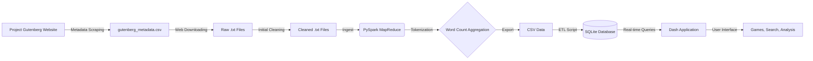

# 🦘 The Roo-Setta Stone

## Deciphering the Project Gutenberg Library with Big Data

## 📖 Overview

The Roo-Setta Stone is a full-stack Data Science application designed to analyze, visualize, and gamify the vast Project Gutenberg library (~24,000 books).

The project employs a classic MapReduce strategy using PySpark to ingest over 8GB of raw text data (approx. 1.4 billion words). The resulting word frequency distributions are indexed in an optimized SQLite database to power a real-time interactive Dash frontend. Users can search for specific books, play data-driven literary games, and explore deep stylistic analytics like Zipf's Law validation and Hapax Legomena ratios.

## ⚙️ Architecture

The pipeline transforms unstructured raw text into structured, queryable insights.



### 1. Metadata Scraping (book_web_scrapper.ipynb)

**Input**: Project Gutenberg website (https://www.gutenberg.org/ebooks/).

**Process**:
- Scrapes Project Gutenberg book pages using `requests` and `BeautifulSoup`
- Extracts metadata from the `bibrec` table for each book:
  - Book number, title, author, language
  - Genres (filtered by predefined categories)
  - Plain text download URL
- Filters books by:
  - English language only
  - Specific genre categories (Adventure, Classics, Novels, etc.)
  - Availability of plain text UTF-8 format
- Uses concurrent threading (ThreadPoolExecutor) to scrape multiple books in parallel
- Processes book IDs from 1 to ~75,000 to find all available books

**Output**: `gutenberg_metadata.csv` containing ~24,000 book records with metadata and download URLs.

### 2. Web Scraping & Downloading (book_web_downloader.ipynb)

**Input**: `gutenberg_metadata.csv` (created by `book_web_scrapper.ipynb`) containing book metadata and download URLs.

**Process**: 
- Loads metadata dictionary mapping book IDs to download URLs
- Uses `requests` library to download plain text files from Project Gutenberg
- Implements concurrent threading (ThreadPoolExecutor with 10 workers) for parallel downloads
- Handles encoding (UTF-8) and file naming conventions
- Skips already-downloaded files for efficient re-runs

**Output**: Raw text files saved to `project_books_raw/` directory (~24,000 files, ~8GB).

### 3. Initial Data Cleaning (book_file_cleanup.py)

**Input**: Raw text files from `project_books_raw/` directory.

**Process**:
- Reads files with UTF-8 encoding (falls back to Latin-1 for older texts)
- Removes Project Gutenberg headers and footers using standard markers:
  - `*** START OF` - marks the beginning of actual book content
  - `*** END OF` - marks the end of book content
- Strips whitespace and preserves only the core literary text
- Handles edge cases where markers may be missing (fallback preserves original)

**Output**: Cleaned text files saved to `project_books_clean/` directory, ready for MapReduce processing.

### 4. The MapReduce Backend (spark_wordcount.py)

**Input**: 24,000+ cleaned .txt files from `project_books_clean/`.

**Map**: Tokenizes text, handles strict encoding cleanup (UTF-8/Latin-1), and emits ((book_id, word), 1).

**Reduce**: Aggregates counts by key to produce final word frequency tables.

**Output**: A consolidated dataset of 1.4 billion processed tokens.

### 5. The Frontend (app.py)

Built with Plotly Dash for a reactive, single-page application (SPA) experience.

Uses CSS Grid and Flexbox for a responsive, polished UI.

Features dynamic graph generation using Plotly Express.

## 🚀 Key Features

### 🔍 Book Search

A complete catalog explorer. Users can search by title or author and instantly retrieve detailed word usage statistics for any book in the library.

### 🎮 The Game Hub

Four data-driven mini-games that test your literary intuition:

- **A Book with a Clue**: Can you identify a book based only on its "Data Fingerprint" (Top 15 unique words)?
- **Much Ado About Counting**: Guess which word appears more frequently in a specific classic.
- **Tale of Two Counts**: A "Stat Attack" style battle between two books.
- **Little Red Herring**: Spot the imposter word that doesn't belong in the author's vocabulary.

### 📊 Data Analysis Hub

- **Distributions**: Validates Zipf's Law across the entire corpus (log-log linearity check).
- **Author Stylometry**: Compares "Prolific" vs. "Casual" authors. Includes analysis of Hapax Legomena (words used exactly once) to measure vocabulary richness.

### 💞 Literary Pairings

- **Unique Twins**: Finds books that share the exact same vocabulary size.
- **Word Twins**: A vector search engine that finds books that use specific words the exact same number of times.

## 🛠️ Installation & Setup

### Prerequisites

- Python 3.9+
- Java 8+ (Required for PySpark)

### 1. Clone the Repository

```bash
git clone https://github.com/your-username/roo-setta-stone.git
cd roo-setta-stone
```

### 2. Install Dependencies

```bash
pip install -r requirements.txt
```

### 3. Initialize Data & Assets

**Note**: The SQLite database (project_books.db) is required. If running from scratch, you must run the full ETL pipeline starting from step 3a. If `gutenberg_metadata.csv` is provided, skip to step 3b. If the DB is provided, skip to step 3e.

#### 3a. Scrape Metadata (Only if building from scratch):

**Prerequisites**: None - this is the first step in the pipeline.

```bash
# Run the Jupyter notebook to scrape book metadata from Project Gutenberg
jupyter notebook book_web_scrapper.ipynb
# Or convert to Python script and run:
# jupyter nbconvert --to script book_web_scrapper.ipynb
# python book_web_scrapper.py
```

This will scrape Project Gutenberg website to extract book metadata (title, author, genres, download URLs) and save to `gutenberg_metadata.csv`. The process uses concurrent threading and may take several hours depending on network speed and the number of books processed.

#### 3b. Download Raw Data (Required after metadata scraping):

**Prerequisites**: Ensure `gutenberg_metadata.csv` exists (created in step 3a).

```bash
# Run the Jupyter notebook to download books from Project Gutenberg
jupyter notebook book_web_downloader.ipynb
# Or convert to Python script and run:
# jupyter nbconvert --to script book_web_downloader.ipynb
# python book_web_downloader.py
```

This will download ~24,000 books to `project_books_raw/` directory (~8GB). The process uses concurrent threading and may take 30-60 minutes depending on network speed.

#### 3c. Clean Raw Data (Required after downloading):

```bash
python book_file_cleanup.py   # Remove Gutenberg headers/footers
```

This processes files from `project_books_raw/` and outputs cleaned versions to `project_books_clean/`.

#### 3d. Run MapReduce & ETL (Required after cleaning):

```bash
python spark_wordcount.py   # Process cleaned text (Requires Spark)
python csv_to_sqlite.py     # Build Database
```

#### 3e. Generate Static Assets (REQUIRED):

This script pre-calculates the heavy visualizations (Zipf's Law, Author Stats) to ensure the UI remains fast.

```bash
python generate_plots.py
```

### 4. Launch the App

```bash
python app.py
```

Open your browser to `http://127.0.0.1:8050/`.

## 📂 Project Structure

```
roo-setta-stone/
├── app.py                  # Main Dash Application Entry Point
├── data_loader.py          # Global Theme & Metadata Loader
├── game_utils.py           # Core Game Logic & Database Queries
├── generate_plots.py       # Pre-calculation script for Analysis Hub
│
├── data_pipeline/          # Data Acquisition & Processing
│   ├── book_web_scrapper.ipynb    # Metadata scraping (creates gutenberg_metadata.csv)
│   ├── book_web_downloader.ipynb  # Book downloading script (Jupyter)
│   ├── book_file_cleanup.py       # Initial data cleaning
│   ├── spark_wordcount.py         # PySpark MapReduce processing
│   └── csv_to_sqlite.py           # ETL to SQLite database
│
├── pages/                  # Dash Pages (Multi-Page Architecture)
│   ├── home.py             # Landing Page
│   ├── search.py           # Book Search Interface
│   ├── game_hub.py         # Menu for Games
│   ├── pairings_hub.py     # Menu for Literary Pairings
│   ├── analysis_hub.py     # Menu for Data Analysis
│   ├── book_view.py        # Individual Book Details View
│   ├── distributions.py    # Zipf's Law & Library Stats
│   └── authors.py          # Author Stylometry & Leaderboards
│
├── assets/                 # Static Assets (CSS, Images, JSON Plots)
│   ├── style.css           # Global Styling
│   └── plots/              # Pre-generated Plotly JSON files
│
├── project_books_raw/      # Raw downloaded files (~8GB)
├── project_books_clean/    # Cleaned files (headers/footers removed)
├── project_books.db        # SQLite Database (Word Counts)
└── gutenberg_metadata.csv  # Book Metadata (Title, Author, Genre)
```


## 👥 Authors

- **Brady Maes**
- **Joseph Marinello**

Principles of Big Data Management Project for the MS in Data Science at the University of Missouri-Kansas City.
