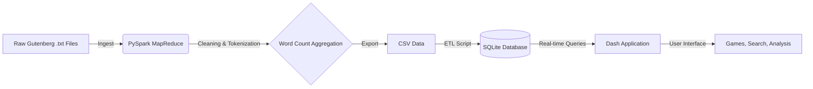

# 🦘 The Roo-Setta Stone

## Deciphering the Project Gutenberg Library with Big Data

## 📖 Overview

The Roo-Setta Stone is a full-stack Data Science application designed to analyze, visualize, and gamify the vast Project Gutenberg library (~24,000 books).

The project employs a classic MapReduce strategy using PySpark to ingest over 8GB of raw text data (approx. 1.4 billion words). The resulting word frequency distributions are indexed in an optimized SQLite database to power a real-time interactive Dash frontend. Users can search for specific books, play data-driven literary games, and explore deep stylistic analytics like Zipf's Law validation and Hapax Legomena ratios.

## ⚙️ Architecture

The pipeline transforms unstructured raw text into structured, queryable insights.



### 1. The MapReduce Backend (spark_wordcount.py)

Input: 24,000+ .txt files from Project Gutenberg.

Map: Tokenizes text, handles strict encoding cleanup (UTF-8/Latin-1), and emits ((book_id, word), 1).

Reduce: Aggregates counts by key to produce final word frequency tables.

Output: A consolidated dataset of 1.4 billion processed tokens.

### 2. The Frontend (app.py)

Built with Plotly Dash for a reactive, single-page application (SPA) experience.

Uses CSS Grid and Flexbox for a responsive, polished UI.

Features dynamic graph generation using Plotly Express.

## 🚀 Key Features

### 🔍 Book Search

A complete catalog explorer. Users can search by title or author and instantly retrieve detailed word usage statistics for any book in the library.

### 🎮 The Game Hub

Four data-driven mini-games that test your literary intuition:

- **A Book with a Clue**: Can you identify a book based only on its "Data Fingerprint" (Top 15 unique words)?
- **Much Ado About Counting**: Guess which word appears more frequently in a specific classic.
- **Tale of Two Counts**: A "Stat Attack" style battle between two books.
- **Little Red Herring**: Spot the imposter word that doesn't belong in the author's vocabulary.

### 📊 Data Analysis Hub

- **Distributions**: Validates Zipf's Law across the entire corpus (log-log linearity check).
- **Author Stylometry**: Compares "Prolific" vs. "Casual" authors. Includes analysis of Hapax Legomena (words used exactly once) to measure vocabulary richness.

### 💞 Literary Pairings

- **Unique Twins**: Finds books that share the exact same vocabulary size.
- **Word Twins**: A vector search engine that finds books that use specific words the exact same number of times.

## 🛠️ Installation & Setup

### Prerequisites

- Python 3.9+
- Java 8+ (Required for PySpark)

### 1. Clone the Repository

```bash
git clone https://github.com/your-username/roo-setta-stone.git
cd roo-setta-stone
```

### 2. Install Dependencies

```bash
pip install -r requirements.txt
```

### 3. Initialize Data & Assets

**Note**: The SQLite database (project_books.db) is required. If running from scratch, you must run the ETL scripts. If the DB is provided, skip to step 3b.

#### 3a. Run ETL (Only if building from raw data):

```bash
python spark_wordcount.py   # Process raw text (Requires Spark)
python csv_to_sqlite.py     # Build Database
```

#### 3b. Generate Static Assets (REQUIRED):

This script pre-calculates the heavy visualizations (Zipf's Law, Author Stats) to ensure the UI remains fast.

```bash
python generate_plots.py
```

### 4. Launch the App

```bash
python app.py
```

Open your browser to `http://127.0.0.1:8050/`.

## 📂 Project Structure

```
roo-setta-stone/
├── app.py                  # Main Dash Application Entry Point
├── data_loader.py          # Global Theme & Metadata Loader
├── game_utils.py           # Core Game Logic & Database Queries
├── generate_plots.py       # Pre-calculation script for Analysis Hub
│
├── pages/                  # Dash Pages (Multi-Page Architecture)
│   ├── home.py             # Landing Page
│   ├── search.py           # Book Search Interface
│   ├── game_hub.py         # Menu for Games
│   ├── pairings_hub.py     # Menu for Literary Pairings
│   ├── analysis_hub.py     # Menu for Data Analysis
│   ├── book_view.py        # Individual Book Details View
│   ├── distributions.py    # Zipf's Law & Library Stats
│   └── authors.py          # Author Stylometry & Leaderboards
│
├── assets/                 # Static Assets (CSS, Images, JSON Plots)
│   ├── style.css           # Global Styling
│   └── plots/              # Pre-generated Plotly JSON files
│
├── project_books.db        # SQLite Database (Word Counts)
└── gutenberg_metadata.csv  # Book Metadata (Title, Author, Genre)
```


## 👥 Authors

- **Brady Maes** - Data Science & Backend Engineering
- **Joseph Marinello** - Data Science & Frontend Logic

Capstone Project for the MS in Data Science at the University of Missouri-Kansas City.
